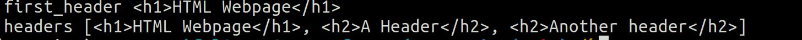

# BeautifulSoup Course

1. [Instalar librerias necesarias](#schema20)
2. [Importamos librerías ](#schema2)
3. [Cargamos el html](#schema3)
4. [find and find_all](#schema4)
5. [select (CSS selector)](#schema5)
6. [Obtener diferentes propiedades del HTML](#schema6)
7. [Documentación](#schema7)

# 1. Instalar librerias necesarias
~~~python
conda install -c anaconda beautifulsoup4
conda install -c anaconda lxml
conda install -c anaconda requests

~~~

# 2. Importamos librerías 
~~~python
from bs4 import BeautifulSoup as bs
import requests
import re
~~~

# 3. Cargamos el html

~~~python
url = "https://keithgalli.github.io/web-scraping/example.html"
r = requests.get(url)

# Convertir a un objeto de beautiful soup
soup = bs(r.content, 'lxml')

~~~

hr>

# 4. find and find_all
~~~python
first_header = soup.find("h2")

headers = soup.find_all("h2")

~~~

Pasar una lista de elementos
~~~python
first_header = soup.find(["h1", "h2"])

headers = soup.find_all(["h1", "h2"])
~~~

Podemos pasarale atributos a find/find_all
~~~python
paragraph = soup.find_all("p", attrs={"id": "paragraph-id"})
~~~

Podemos anidar llamadas
~~~python
body = soup.find('body')
div = body.find('div')
header = div.find('h1')
~~~

Podemos buscar una cadena específica en find/find_all
~~~python
paragraphs = soup.find_all("p", string=re.compile("Some"))
headers = soup.find_all("h2", string=re.compile("(H|h)eader"))
~~~

# 5. select (CSS selector)

~~~python
#print(soup.body.prettify())

content = soup.select("div p")
~~~

~~~python

content = soup.select("div p")
#print(content)
~~~

~~~python
paragraphs = soup.select("h2 ~ p")
bold_text = soup.select("p#paragraph-id b")
~~~

~~~python

paragraphs = soup.select("body > p")

for paragraph in paragraphs:
  print(paragraph.select("i"))
~~~

# 6. Obtener diferentes propiedades del HTML

~~~python

header = soup.find("h2")
print(header.string)

div = soup.find("div")
print(div.prettify())
print(div.get_text())
~~~

~~~python
link = soup.find("a")
print(link['href'])

paragraphs = soup.select("p#paragraph-id")
print(paragraphs[0]['id'])
~~~

# 7. Documentación

https://www.youtube.com/watch?v=GjKQ6V_ViQE&t=9s

https://github.com/KeithGalli/web-scraping